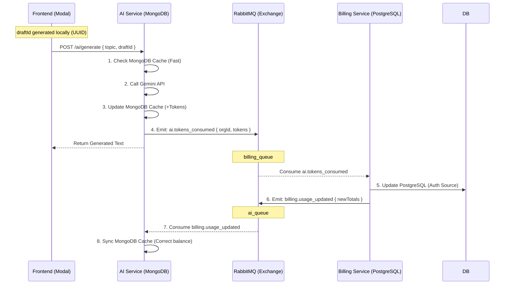

# AI Generation & Billing Flow

This diagram illustrates how AI requests are processed, logged via session IDs (draftId), and billed asynchronously via RabbitMQ.

```mermaid
sequenceDiagram
    participant FE as Frontend (Modal)
    participant AI as AI Service (MongoDB)
    participant RMQ as RabbitMQ (Exchange)
    participant BILL as Billing Service (PostgreSQL)

    Note over FE: draftId generated locally (UUID)
    FE->>AI: POST /ai/generate { topic, draftId }
    AI->>AI: 1. Check MongoDB Cache (Fast)
    AI->>AI: 2. Call Gemini API
    AI->>AI: 3. Update MongoDB Cache (+Tokens)
    AI->>RMQ: 4. Emit: ai.tokens_consumed { orgId, tokens }
    AI-->>FE: Return Generated Text
    
    Note over RMQ: billing_queue
    RMQ-->>BILL: Consume ai.tokens_consumed
    BILL->>DB: 5. Update PostgreSQL (Auth Source)
    BILL->>RMQ: 6. Emit: billing.usage_updated { newTotals }
    
    Note over RMQ: ai_queue
    RMQ-->>AI: 7. Consume billing.usage_updated
    AI->>AI: 8. Sync MongoDB Cache (Correct balance)
```
