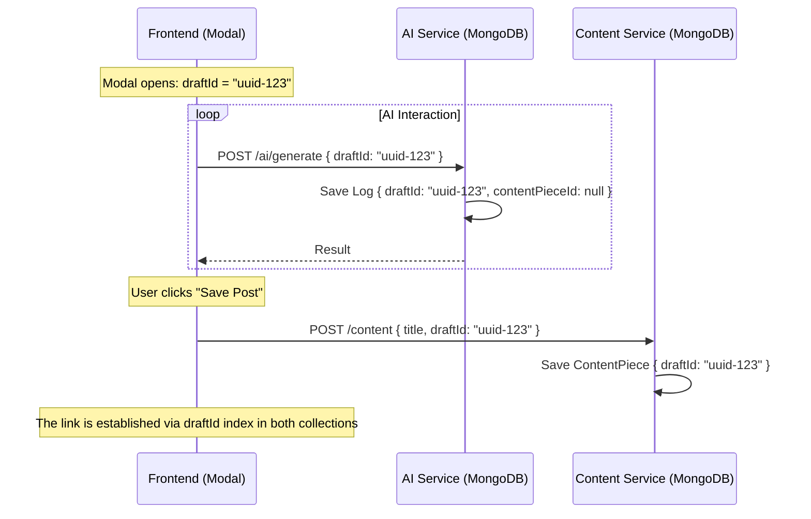

# Content Creation & Session Linking

This diagram explains how the KERN architecture links orphaned AI logs to permanent Content Pieces using a client-side generated `draftId`.

```mermaid
sequenceDiagram
    participant FE as Frontend (Modal)
    participant AI as AI Service (MongoDB)
    participant CON as Content Service (MongoDB)

    Note over FE: Modal opens: draftId = "uuid-123"
    
    loop AI Interaction
        FE->>AI: POST /ai/generate { draftId: "uuid-123" }
        AI->>AI: Save Log { draftId: "uuid-123", contentPieceId: null }
        AI-->>FE: Result
    end
    
    Note over FE: User clicks "Save Post"
    
    FE->>CON: POST /content { title, draftId: "uuid-123" }
    CON->>CON: Save ContentPiece { draftId: "uuid-123" }
    
    Note over FE: The link is established via draftId index in both collections
```
