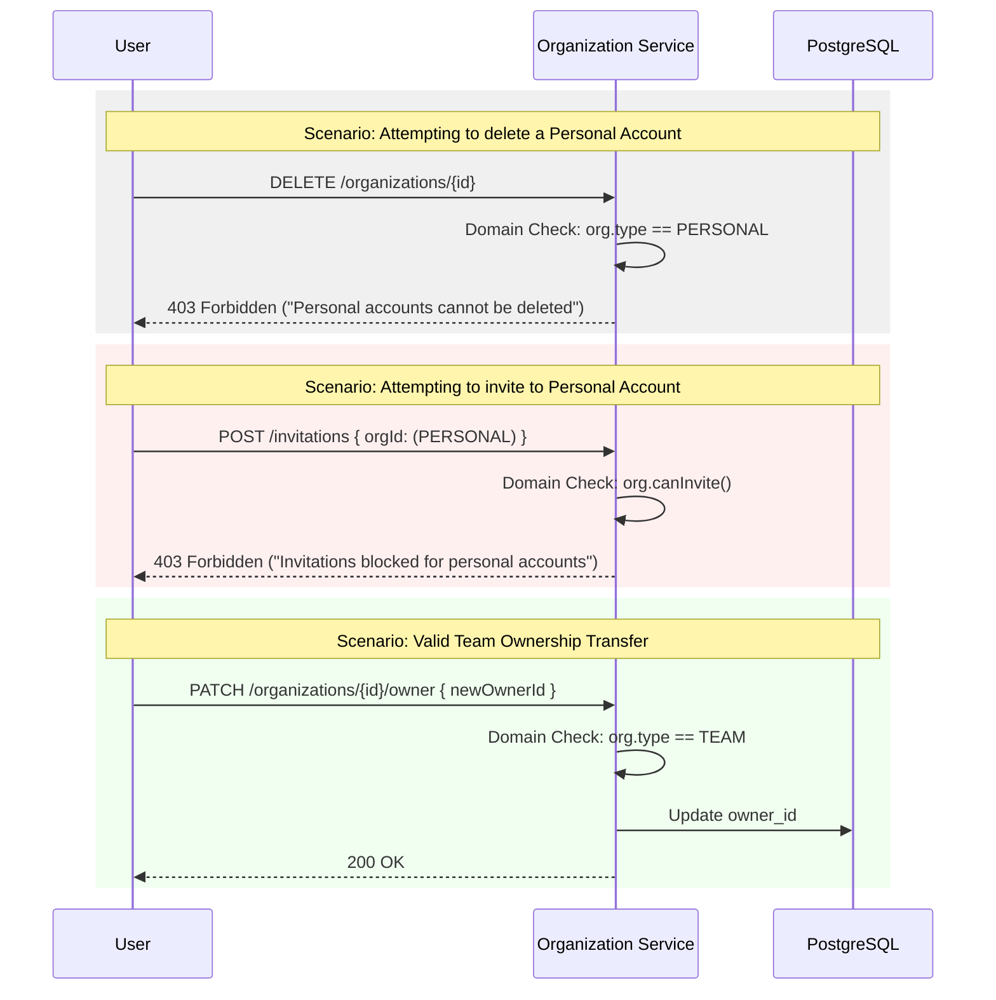

# Organization Type & Security Logic

This diagram explains the business rules enforced at the domain level for different Organization Types (PERSONAL vs TEAM).

```mermaid
sequenceDiagram
    participant User
    participant ORG as Organization Service
    participant DB as PostgreSQL

    rect rgb(240, 240, 240)
        Note over User, DB: Scenario: Attempting to delete a Personal Account
        User->>ORG: DELETE /organizations/{id}
        ORG->>ORG: Domain Check: org.type == PERSONAL
        ORG-->>User: 403 Forbidden ("Personal accounts cannot be deleted")
    end

    rect rgb(255, 240, 240)
        Note over User, DB: Scenario: Attempting to invite to Personal Account
        User->>ORG: POST /invitations { orgId: (PERSONAL) }
        ORG->>ORG: Domain Check: org.canInvite()
        ORG-->>User: 403 Forbidden ("Invitations blocked for personal accounts")
    end

    rect rgb(240, 255, 240)
        Note over User, DB: Scenario: Valid Team Ownership Transfer
        User->>ORG: PATCH /organizations/{id}/owner { newOwnerId }
        ORG->>ORG: Domain Check: org.type == TEAM
        ORG->>DB: Update owner_id
        ORG-->>User: 200 OK
    end
```
